<details>
<summary><font size=5>Table of Contents</font> </summary>

- [2. Introduction](#2-introduction)
- [3. Prerequisites](#3-prerequisites)
- [4. Demos and Examples](#4-demos-and-examples)
  - [4.1. Sample Applications](#41-sample-applications)
  - [4.2. Demo Setup](#42-demo-setup)
    - [4.2.1. NCP mode AoD asset](#421-ncp-mode-aod-asset)
    - [4.2.2. SoC mode AoD asset](#422-soc-mode-aod-asset)
- [5. Antenna Array Accuracy](#5-antenna-array-accuracy)
  - [5.1. Environment 1 (3 tag, 4 locators, static measurement)](#51-environment-1-3-tag-4-locators-static-measurement)
    - [5.1.1. Real position of the locators and tags.](#511-real-position-of-the-locators-and-tags)
    - [5.1.2. Estimated position by RTL lib](#512-estimated-position-by-rtl-lib)
  - [5.2. Environment 2 (9 tag, 4 locators, static measurement)](#52-environment-2-9-tag-4-locators-static-measurement)
    - [5.2.1. Real position of the locators and tags.](#521-real-position-of-the-locators-and-tags)
    - [5.2.2. Estimated position by RTL lib](#522-estimated-position-by-rtl-lib)
  - [5.3. Environment 3 (3 tag, 4 locators, static measurement)](#53-environment-3-3-tag-4-locators-static-measurement)
    - [5.2.1. Real position of the locators and tags.](#521-real-position-of-the-locators-and-tags-1)
    - [5.1.2. Estimated position by RTL lib](#512-estimated-position-by-rtl-lib-1)
- [6. Development](#6-development)
  - [6.1. Create the AoD Beacon project base on soc-empty example](#61-create-the-aod-beacon-project-base-on-soc-empty-example)
  - [6.2. Create NCP mode AoD asset base on ncp example](#62-create-ncp-mode-aod-asset-base-on-ncp-example)
  - [6.3. Build the AoA_Locator project](#63-build-the-aoa_locator-project)
  - [6.4. Build the AoD_Locator project](#64-build-the-aod_locator-project)
  - [6.5. Create the AoD SoC mode Asset project base on soc-empty example](#65-create-the-aod-soc-mode-asset-project-base-on-soc-empty-example)
  - [6.6. Build the AoD Gateway project](#66-build-the-aod-gateway-project)
- [How to run?](#how-to-run)
  - [](#)
  - [Run aod_locator host application](#run-aod_locator-host-application)
  - [Run the aod_gateway host application](#run-the-aod_gateway-host-application)

</details>

***

# 2. Introduction
Bluetooth Angle of Arrival (AoA) and Angle of Departure (AoD) are new technologies that establish a standardized framework for indoor positioning. With these technologies, the fundamental problem of positioning comes down to solving the arrival and departure angles of radio frequency signals. 
SiliconLabs has the [UG103.18: Bluetooth® Direction Finding
Fundamentals](https://www.silabs.com/documents/public/user-guides/ug103-18-bluetooth-direction-finding-fundamentals.pdf) to explain the basic of the AoA and AoD technology, and 
has [AN1296: Application Development with Silicon Labs’ RTL Library] and [AN1297: Custom Direction-Finding Solutions using the Silicon Labs Bluetooth Stack] to explain how develop the direction finding (DF) applications using the Silicon Labs Bluetooth LE stack and the Real Time Locating Library (RTL lib). 
Please note that all of these three documentations are the fundament to understand the basic of Bluetooth Direction Finding as well as the Silicon Labs solution for it. It's supposed that you've read them. 
This project will show you how to build a AoD application with Silicon Labs Bluetooth LE stack and the RTL Lib. This documentation walks through the steps to help anyone get stared with AoD solution.

# 3. Prerequisites
Running the demo requires the following devices:   
* Thunderboard BG22 (SLTB010A)
* BRD4185A antenna array board with a WSTK x 3
* A PC running Simplicity Studio 5 with Gecko SDK Suite v3.2 or later
* A Raspberry Pi

# 4. Demos and Examples
## 4.1. Sample Applications

* **soc_aod_beacon** should be built in Studio, and flashed to the Antenna array board. This will act as a beacon (CTE transmitter)   
* **ncp_aod_asset** should be built in Studio and flashed to a Thunderboard BG22. This will act as the asset, that receives the CTE and wants to determine its position.   
* **aod_compass** should be built outside of studio using MSYS2 mingw 64-bit, the same way as the aoa_compass is built, see documentation in QSG175. The main difference between aoa_compass and aod_compass is, that aod_compass has to connect to the Thunderboard instead of the antenna array board. This time, the angles/position is calculated on the Thunderboard side. So now the Thunderboard acts like an ncp target, and it connects to the PC, which then does the calculation.   
* **aod_locator** is the host sample app running on the host demonstrates the CTE Receiver feature and the usage of the angle estimation feature of the RTL library.   

## 4.2. Demo Setup
There are two kind of system structure for the multi-transmitter AoD demo. Customer can choose anyone of them depends on their own system design. 
In the first case, the AoD tag asset will work in NCP mode for I/Q sample, the host application **aod_locator** runs on the host MCU or PC will receive the I/Q sample result from the tag via BGAPI interface, and calculate the angle and position according to the I/Q data.
In the second case, the AoD tag asset work in SoC mode for I/Q sample, after finishing the sampling it will transmit the I/Q sample data to the gateway via Bluetooth connection. After receiving the I/Q sample from each AoD tag, the gateway runs **aod_gateway** application will calculate the angle and position.

For getting start with these two kind of multi-transmitter AoD demos, please follow the steps below.   

### 4.2.1. NCP mode AoD asset
* Please flash a bootloader to each of your boards   
* Please build and flash the **soc_aod_beacon.sls** project to your antenna array boards. You can also find the prebuilt image now for your convenience.   
* Please build and flash the **ncp_aod_asset.sls** project to your Thunderboard. You can also find the prebuilt image now for your convenience.   
* Please copy the attached **aod_locator** project into the following folder:   
    C:\SiliconLabs\SimplicityStudio\v5\developer\sdks\gecko_sdk_suite\v3.1\app\bluetooth\example_host   
* Start MSYS2 MinGW 64-bit, browse to the **aod_locator** folder, and build the project simply by running make (there will be some warnings, neglect them)   
* Navigate to the config folder, and change the multilocator_config.json file according to your setup (change the addresses, position and orientation of your antenna array boards)   
* Navigate to the exe folder, and start the project like this (change the COM port to the one used by the Thunderboard BG22):   
    ./aod_locator.exe -u COM49 -c ../config/multilocator_config.json  
Below is the system block diagram for the case of AoD tag asset works in NCP mode.
<div align="center">
  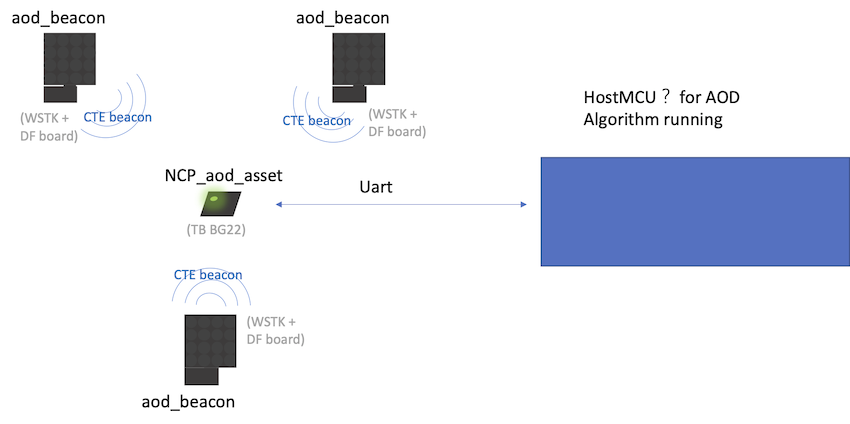  
</div>  
<div align="center">
  <b>Figure 1-1 AoD NCP mode block diagram</b>
</div>  
</br>

### 4.2.2. SoC mode AoD asset
* Build the **soc_aod_beacon** project and flash the image to the antenna array boards. Please make sure that a bootloader is also flashed before.   
* Build the **soc_aod_asset** project and flash the image to the Thunderboard BG22.   
* Flash **NCP - Empty Demo** to a BG22 radio board which acts as the gateway combine with the Raspberry Pi or your PC runs the **aod_gateway** host application.  
* Copy the **aod_gateway** project to the folder ```C:\SiliconLabs\SimplicityStudio\v5\developer\sdks\gecko_sdk_suite\v3.1\app\bluetooth\example_host```   
* Open MSYS2 MinGW 64 bit, browse to the **aod_gateway** folder and run 'make'   
* Make sure mqtt broker is running   
* start the **aod_gateway** app like this:   
    ./exe/aod_gateway.exe -c xxx.jason -u COM8   
    where the COM port should be the COM port of the BG22 board programmed with NCP empty demo image.  
* start mqtt explorer, and check if you can see the angles calculated for each locator   
<div align="center">
  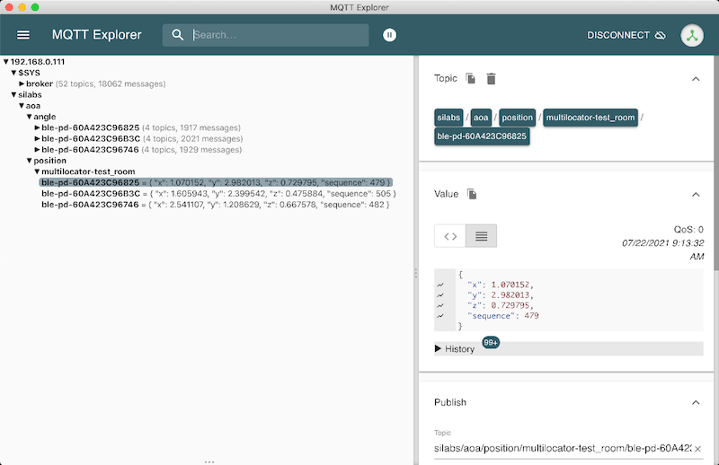  
</div>  
* start the aoa_multilocator and aoa_multilocator_gui apps as described in AN1296   
    Note: the multilocator_configuration should be exactly the same for AoD as it is for AoA   

Below is the system block diagram for the case of AoD tag asset works in SoC mode.

<div align="center">
    
</div>  
<div align="center">
  <b>Figure 1-2 AoD SoC mode block diagram</b>
</div>  
</br>


<div align="center">
    
</div>  
<div align="center">
  <b>Figure 1-3 AoD SoC mode block diagram</b>
</div>  
</br>

# 5. Antenna Array Accuracy
Direction finding accuracy depends strongly on the amount of different phase information in the receiver. The number of channels/antennas affects the overall angle accuracy. However, increasing the number of antennas requires more and more memory for the calculations and increases PCB size as well.
The 4x4 array was chosen as the reference based on the most optimal system performance for smallest array size.
We has performed real environment testing on the 4x4 array with the following results. The measurements were performed using Gecko SDK 3.2 and RTL library API: SL_RTL_AOX_MODE_REAL_TIME_BASIC.

The following devices were used for all antenna array accuracy measurements in this section:
• Locator: BRD4185A Rev A01
• Tag: BRD4184A Rev A02

## 5.1. Environment 1 (3 tag, 4 locators, static measurement)
* Location: Office environment, open space   
* Locator height from floor: 0.0 m   
* Tag height from floor: 0.75 m   
* Testing range: 3.8x3.9m2   
* Real position of the locators and tags
<div align="center">
  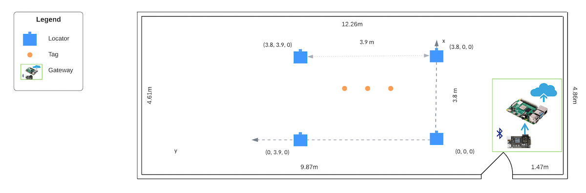  
</div>  

There are total 4 locators and 3 tags in the 3.8x3.9 area, below are the measured position and angle accuracy for the tags.

### 5.1.1. Real position of the locators and tags.
|Locator ID | X | Y | Z |
|-|-|-|-|
|#1 ble-pd-588E81A54222 | 3.80 | 3.90 | 0.00 |
|#2 ble-pd-588E8166AF43 | 0.00 | 0.00 | 0.00 |
|#3 ble-pd-84FD27EEE4FF | 3.80 | 0.00 | 0.00 |
|#4 ble-pd-588E81A5421C | 0.00 | 3.90 | 0.00 |
<div align="center">
    
</div>  

|Tag ID | X | Y | Z |
|-|-|-|-|
|ble-pd-60A423C96825 | 2.00 | 2.90 | 0.75 |
|ble-pd-60A423C96746 | 2.00 | 2.10 | 0.75 |
|ble-pd-60A423C96B3C | 2.00 | 1.30 | 0.75 |

### 5.1.2. Estimated position by RTL lib 
Below is the estimated position of these three tags. We collected all of the position and angle data for each tag, the curve below reflects the X/Y/Z axis value for each tag in 5mins.   
**ble-pd-60A423C96825**
<div align="center">
  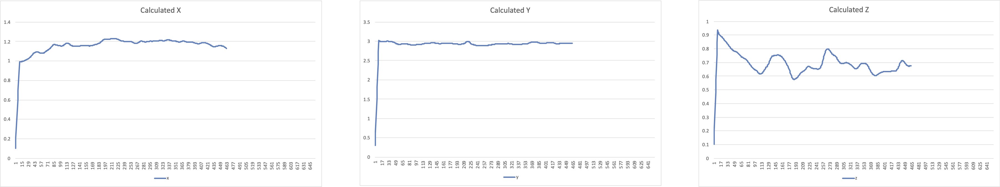  
</div> 

**ble-pd-60A423C96746**
<div align="center">
  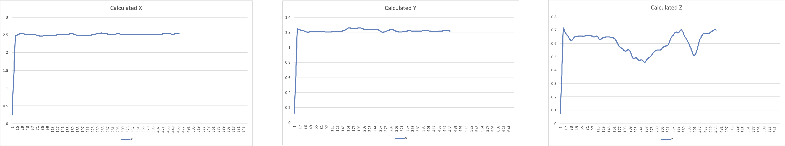  
</div> 

**ble-pd-60A423C96B3C**
<div align="center">
  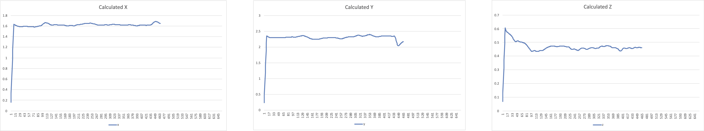  
</div> 

## 5.2. Environment 2 (9 tag, 4 locators, static measurement)
* Location: Office environment, open space   
* Locator height from floor: 0.0 m   
* Tag height from floor: 0.75 m   
* Testing range: 3.8x3.9m2   

### 5.2.1. Real position of the locators and tags.
|Locator ID | X | Y | Z |
|-|-|-|-|
|#1 ble-pd-588E81A54222 | 3.80 | 3.90 | 0.00 |
|#2 ble-pd-588E8166AF43 | 0.00 | 0.00 | 0.00 |
|#3 ble-pd-84FD27EEE4FF | 3.80 | 0.00 | 0.00 |
|#4 ble-pd-588E81A5421C | 0.00 | 3.90 | 0.00 |
<div align="center">
    
</div>  


|Tag ID | X | Y | Z |
|-|-|-|-|
|ble-pd-60A423C96B13 | 2.00 | 3.20 | 0.75 |
|ble-pd-60A423C96896 | 2.00 | 2.90 | 0.75 |
|ble-pd-60A423C96AB5 | 2.00 | 2.60 | 0.75 |
|ble-pd-60A423C96721 | 2.00 | 2.30 | 0.75 |
|ble-pd-60A423C96B3C | 2.00 | 2.00 | 0.75 |
|ble-pd-60A423C96825 | 2.00 | 1.70 | 0.75 |
|ble-pd-60A423C968C6 | 2.00 | 1.40 | 0.75 |
|ble-pd-60A423C96FC6 | 2.00 | 1.10 | 0.75 |
|ble-pd-60A423C96746 | 2.00 | 0.80 | 0.75 |

### 5.2.2. Estimated position by RTL lib 
Below is the estimated position shown in GUI, and we can monitor the value with the MQTT Explorer.
<div align="center">
  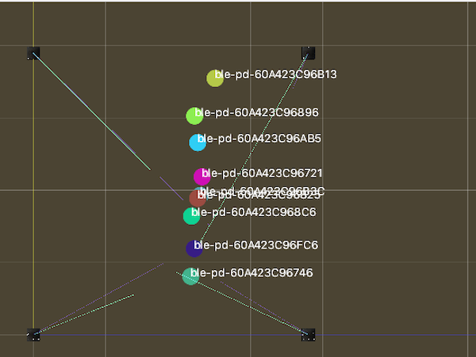  
</div>  

<div align="center">
  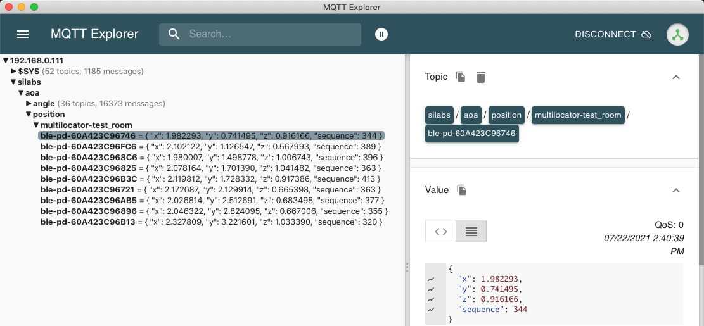  
</div>  

Also we collected all of the position and angle data for each tag, the curve below reflects the X/Y/Z axis value for each tag in 5mins.

**ble-pd-60A423C96B13**
<div align="center">
  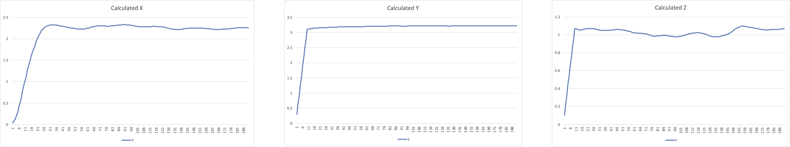  
</div> 

**ble-pd-60A423C96896**
<div align="center">
  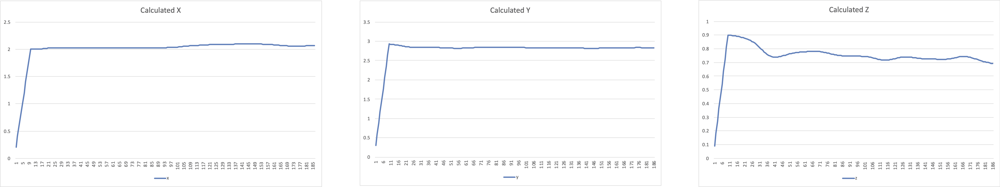  
</div> 

**ble-pd-60A423C96AB5**
<div align="center">
  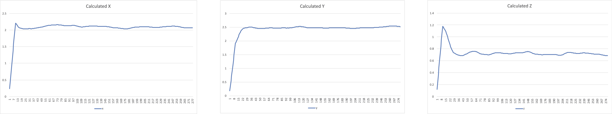  
</div> 

**ble-pd-60A423C96721**
<div align="center">
  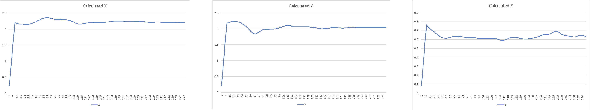  
</div> 

**ble-pd-60A423C96B3C**
<div align="center">
  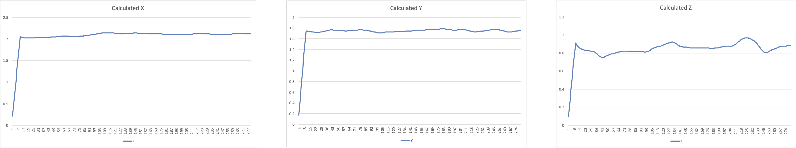  
</div> 

**ble-pd-60A423C96825**
<div align="center">
  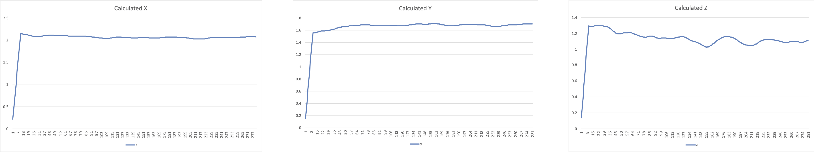  
</div> 

**ble-pd-60A423C968C6**
<div align="center">
  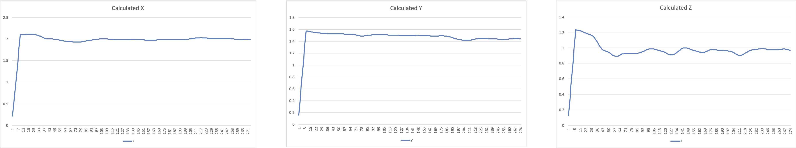  
</div> 

**ble-pd-60A423C96FC6**
<div align="center">
  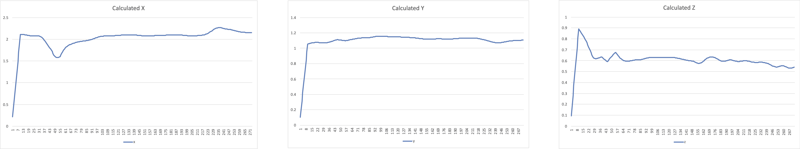  
</div> 

**ble-pd-60A423C96746**
<div align="center">
  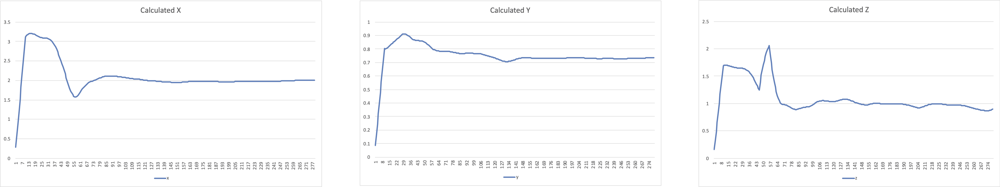  
</div> 


## 5.3. Environment 3 (3 tag, 4 locators, static measurement)
* Location: Office environment, open space   
* Locator height from floor: 0.0 m   
* Tag height from floor: 0.75 m   
* Testing range: 2x9m2   
* Real position of the locators and tags

### 5.2.1. Real position of the locators and tags.
|Locator ID | X | Y | Z |
|-|-|-|-|
|#1 ble-pd-588E81A54222 | 2.00 | 9.00 | 0.00 |
|#2 ble-pd-588E8166AF43 | 0.00 | 3.00 | 0.00 |
|#3 ble-pd-84FD27EEE4FF | 2.00 | 0.00 | 0.00 |
|#4 ble-pd-588E81A5421C | 0.00 | 6.00 | 0.00 |
<div align="center">
  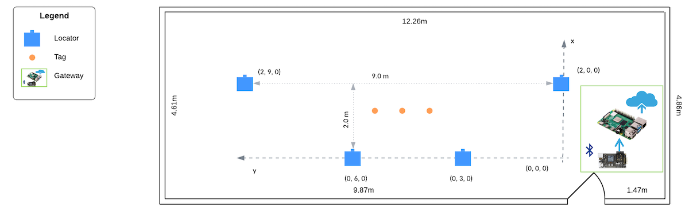  
</div>  

|Tag ID | X | Y | Z |
|-|-|-|-|
|ble-pd-60A423C96825 | 1.40 | 5.30 | 0.75 |
|ble-pd-60A423C96746 | 1.40 | 4.50 | 0.75 |
|ble-pd-60A423C96B3C | 1.40 | 3.70 | 0.75 |

### 5.1.2. Estimated position by RTL lib 
Below is the estimated position of these three tags. We collected all of the position and angle data for each tag, the curve below reflects the X/Y/Z axis value for each tag in 5mins.   
**ble-pd-60A423C96825**
<div align="center">
    
</div> 

**ble-pd-60A423C96746**
<div align="center">
  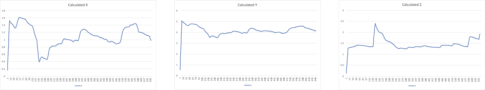  
</div> 

**ble-pd-60A423C96B3C**
<div align="center">
  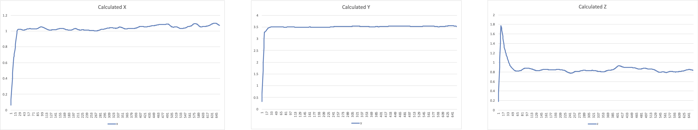  
</div> 

# 6. Development
## 6.1. Create the AoD Beacon project base on soc-empty example
Create a soc-empty project, and then install the components below. 
* RAIL Utility, AoX (Utility to aid with Angle of Arrival/Departure (AoX) Configuration)
* AoA Transmitter (Bluetooth AoA CTE transmission feature)

And then set advertising data and start extended advertising, the CTE will be appended on the extended advertising package. Below is the code snippet.

```c
uint8_t data[3] = {0x02, 0x01, 0x06};
sl_bt_advertiser_set_data(advertising_set_handle, 0, sizeof(data), data);
app_assert_status(sc);

/* Turn off legacy PDU flag. */
sl_bt_advertiser_clear_configuration(advertising_set_handle,1);
app_assert_status(sc);

// Start general advertising and enable connections.
sc = sl_bt_advertiser_start(
  advertising_set_handle,
  advertiser_user_data,
  advertiser_non_connectable);
app_assert_status(sc);

sl_power_manager_add_em_requirement(SL_POWER_MANAGER_EM1);

/* Add CTE to extended advertisements in AoD mode */
sl_bt_cte_transmitter_enable_silabs_cte(advertising_set_handle, CTE_LENGTH, CTE_TYPE, CTE_COUNT, sizeof(antenna_array), antenna_array);
```

The CTE length and slot size is defined as below.
```c
#define CTE_LENGTH  20  // 160ms
#define CTE_TYPE     1  // AoD with 1us slots
#define CTE_COUNT    1  // 1 per interval
```

## 6.2. Create NCP mode AoD asset base on ncp example
Create a ncp-empty project, and install the components below.
* RAIL Utility, AoX (Utility to aid with Angle of Arrival/Departure (AoX) Configuration)
* AoA Receiver (Bluetooth AoA CTE receiving feature)

For the RAIL Utility, AoX component, please configure the Number of AoX Antenna Pins as 4, and configure the SL_RAIL_UTIL_AOX_ANTENNA_PIN0-SL_RAIL_UTIL_AOX_ANTENNA_PIN3 as PC04-PC07 respectively.

## 6.3. Build the AoA_Locator project
With the v3.2.0 Bluetooth SDK release, there is **AoA Analyzer** tool which is a Java based application, built into Simplicity Studio 5, that showcases the angle estimation skills of the RTL library in a graphical user interface.
For how to get started with AoA Analyzer Tool, please see the section "2.1.3 Start the AoA Analyzer Tool", and similar as the previous release, the is a c based host sample app "aoa_locator" which can run on the host demonstrates the CTE Receiver feature and the use of the angle estimation feature of the RTL library. It uses the same application logic as the AoA Analyzer used in the demo setup.   
For how to build the host sample "AoA Locator", please see the section "3.2.1 Building a Single AoA Locator Host Sample Application" of [AN12960](https://www.silabs.com/documents/public/application-notes/an1296-application-development-with-rtl-library.pdf) for step by step instructions.   

Please note that the single AoA locator can be detached from the RTL library and thus does not have to calculate angle values. Instead, it can publish IQ reports directly to the MQTT broker. This can be done using the ANGLE make variable.   
```make APP_MODE=silabs ANGLE=0```

If want to calculate and expose the calculated angle information in the single AoA locator, it can be done with the ANGLE make variable as below.   
```make APP_MODE=silabs ANGLE=1```

在v3.2.0中，AoA_Locator可以支持两种模式，直接publish IQ sample数据，或者publish计算得出的angle数据。

## 6.4. Build the AoD_Locator project
Copy the aod_locator project to the folder below, and build with the command "make APP_MODE=silabs ANGLE=1".

## 6.5. Create the AoD SoC mode Asset project base on soc-empty example
Create a soc-empty project, and install the components below.
* RAIL Utility, AoX (Utility to aid with Angle of Arrival/Departure (AoX) Configuration)
* AoA Receiver (Bluetooth AoA CTE receiving feature)

For the RAIL Utility, AoX component, please configure the Number of AoX Antenna Pins as 4, and configure the SL_RAIL_UTIL_AOX_ANTENNA_PIN0-SL_RAIL_UTIL_AOX_ANTENNA_PIN3 as PC04-PC07 respectively.

For the soc mode AoD tag, it will send the IQ sample data to the gateway device via bluetooth connection, and the gateway is responsible for angle calculation.

## 6.6. Build the AoD Gateway project
Buidl the project with the command below.
```make ANAGLE=1```

# How to run?

## 

## Run aod_locator host application
Configure your locator configuration file, and then execute the command below. "/dev/cu.usbmodem0004401912961" is the COM port of your asset tag working on NCP mode.
./exe/aod_locator -c config/singlelocator_config.json -u /dev/cu.usbmodem0004401912961

## Run the aod_gateway host application
./exe/aod_gateway -u /dev/cu.usbmodem0004401725861