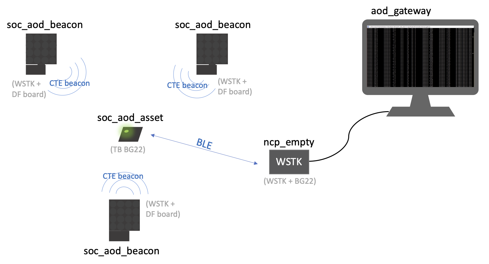
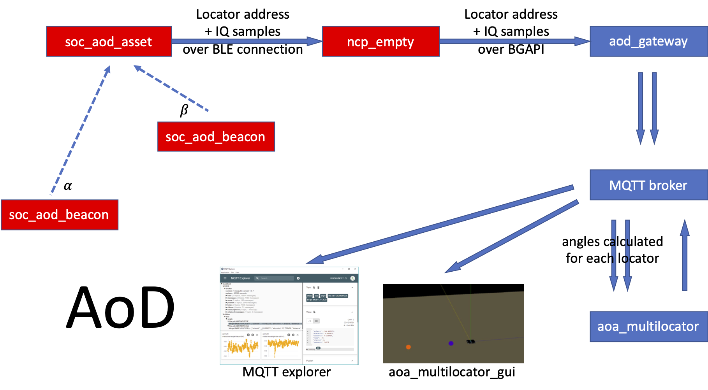

# AoD eFence

***

# Introduction
This is a project demonstrates how to use the AoD for sharing bicycle parking management

# Demos and Examples
## Sample Applications

**soc_aod_beacon** should be built in Studio, and flashed to the Antenna array board. This will act as a beacon (CTE transmitter)
**ncp_aod_asset** should be built in Studio and flashed to a Thunderboard BG22. This will act as the asset, that receives the CTE and wants to determine its position.
**aod_compass** should be built outside of studio using MSYS2 mingw 64-bit, the same way as the aoa_compass is built, see documentation in QSG175. The main difference between aoa_compass and aod_compass is, that aod_compass has to connect to the Thunderboard instead of the antenna array board. This time, the angles/position is calculated on the Thunderboard side. So now the Thunderboard acts like an ncp target, and it connects to the PC, which then does the calculation.
**aod_locator** is the host sample app running on the host demonstrates the CTE Receiver feature and the usage of the angle estimation feature of the RTL library.

## Demo
For getting start with the multi-transmitter AoD demo, please follow the steps below.

### NCP mode AoD asset
* 0) Please flash a bootloader to each of your boards
* 1) Please build and flash the soc_aod_beacon.sls project to your antenna array boards. You can also find the prebuilt image now for your convenience.
* 2) Please build and flash the ncp_aod_asset.sls project to your Thunderboard. You can also find the prebuilt image now for your convenience.
* 3) Please copy the attached aod_locator project into the following folder:
    C:\SiliconLabs\SimplicityStudio\v5\developer\sdks\gecko_sdk_suite\v3.1\app\bluetooth\example_host
* 4) Start MSYS2 MinGW 64-bit, browse to the aod_locator folder, and build the project simply by running make (there will be some warnings, neglect them)
* 5) Navigate to the config folder, and change the multilocator_config.json file according to your setup (change the addresses, position and orientation of your antenna array boards)
* 6) Navigate to the exe folder, and start the project like this (change the COM port to the one used by the Thunderboard):
    ./aod_locator.exe -u COM49 -c ../config/multilocator_config.json

### SoC mode AoD asset
* 1) flash soc_aod_beacon to some antenna array boards. Please make sure, that a bootloader is also flashed, e.g. by flashing the NCP AoA Locator Demo to the board first
* 2) flash soc_aod_asset to a Thunderboard. Please make sure, that a bootloader is also flashed, e.g. by flashing a SoC Thermometer Demo to * the Thunderboard first.
* 3) flash NCP - Empty Demo to a BG22 radio board
* 4) copy the aod_gateway project to C:\SiliconLabs\SimplicityStudio\v5\developer\sdks\gecko_sdk_suite\v3.1\app\bluetooth\example_host
* 5) open MSYS2 MinGW 64 bit, browse to the aod_gateway folder and run 'make'
* 6) make sure mqtt broker is running
* 7) start the aod_gateway app like this:
    ./exe/aod_gateway.exe -u COM8
    where the COM port should be the COM port of the BG22 board programmed with NCP empty
* 8) start mqtt explorer, and check if you can see the angles calculated for each locator
* 9) start the aoa_multilocator and aoa_multilocator_gui apps as described in AN1296
    Note: the multilocator_configuration should be exactly the same for AoD as it is for AoA 

Below is the block diagram of the SoC mode AoD demo.

    

  

  <b>Figure 1-1 AoD SoC mode block diagram</b>

  
 

    

  

  <b>Figure 1-2 AoD SoC mode block diagram</b>

  
 
